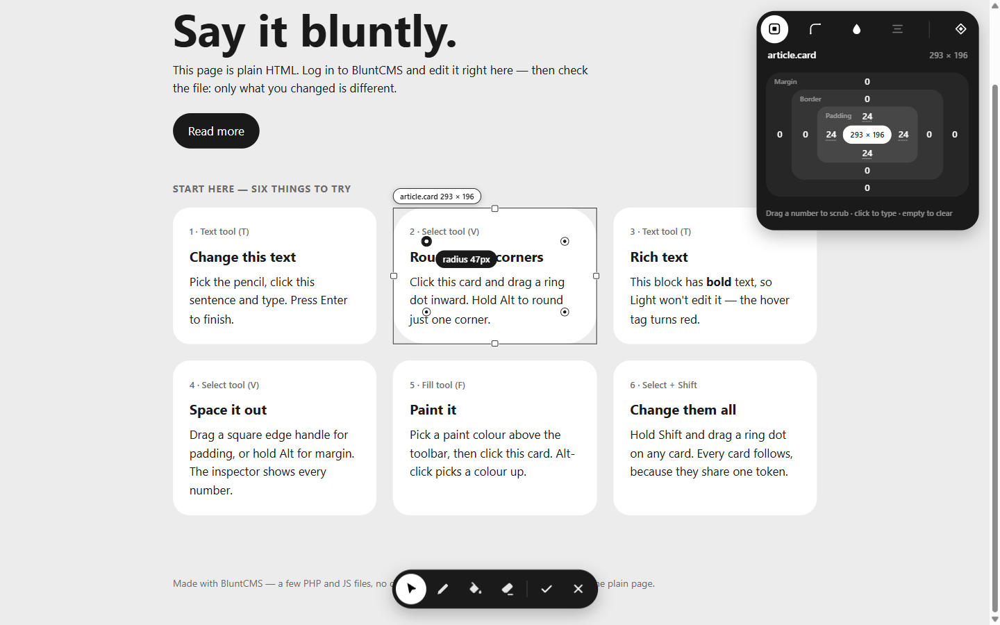

# BluntCMS

  

**Edit your static HTML site right on the page.** Drop one folder next to your `index.html`, log in, and change text, links, corners, spacing and colours — saved straight back into your `.html` files.

No database. No build step. No admin dashboard to learn. *Stupid simple, on purpose.*



## Why it's different

- **Your files stay yours.** Saving changes only the characters you edited — indentation, quotes and comments stay byte-for-byte the same. A one-word edit is a one-word diff.
- **Nothing for visitors to load.** Your pages never contain CMS code. The editor only exists while you're logged in.
- **Delete it any time.** Remove the `blunt/` folder and your site keeps working exactly as before.
- **Feels like a design tool.** Drag corner dots to round corners, drag edges for spacing, Shift-drag to change a shared design token everywhere at once.

## Quick start

You need **PHP 8.1 or newer**.

```bash
git clone https://github.com/Alexander-288/bluntCMS.git
cd bluntCMS
php -S localhost:8000
```

1. Open `http://localhost:8000/blunt/setup.php`
2. Set a password, and use `demo/css/tokens.css` as the token file
3. Log in, then open `http://localhost:8000/blunt/edit.php?page=demo/index.html`

The demo page walks you through six things to try. After you save, run `git diff demo/` and see how little changed.

**Using it on your own site?** Follow the **[tutorial](docs/tutorial.md)** — it takes about ten minutes.

**Want to hear about new versions?** Click **Watch → Custom → Releases** at the top of this page. Stars don't send notifications; watching for releases does. Questions and news live in **[Discussions](https://github.com/Alexander-288/bluntCMS/discussions)**.

## What you can edit

- **Text** — any element you mark with `data-blunt="name"`
- **Links** — text and address of marked links
- **Corners** — all four at once, or one at a time
- **Spacing** — padding and margin on every side
- **Borders** — style, width per side, colour
- **Colours** — text, background and border
- **Layout** — text alignment, centring, and justify / align / gap on flex and grid containers
- **Design tokens** — CSS variables like `--card-radius`; edit once, update everywhere

Mark editable text in your HTML:

```html
<h1 data-blunt="hero-title">Hello world</h1>
<a data-blunt="cta" href="/contact">Get in touch</a>
```

Styles need no marking — select any element.

## Documentation

- **[Tutorial](docs/tutorial.md)** — set it up and learn every tool, step by step
- **[Install](docs/install.md)** — the short version, plus nginx and password resets
- **[Editor](docs/editor.md)** — every tool, handle and shortcut
- **[Architecture](docs/architecture.md)** — how saving, matching and security work
- **[Testing](docs/testing.md)** — automated tests and the manual checklist

## Release naming

BluntCMS ships in tiers. Each tier builds on the one before it.

- **BluntCMS Light** — *the base of everything.* Text, links and style editing, single admin. **This is the current release: 1.0.0-Light.**
- **BluntCMS Thick** — Light plus *image uploads*, and positioning, sizing and display controls in the inspector.
- **BluntCMS Co-op** — *idea stage.* Possibly multiple users.
- **FattCMS** — *the fat cousin.* A separate, heavier project for everything that doesn't belong in Blunt. **Not yet avaialble**

Names beyond Light are not final.

## Requirements

- **Server:** PHP 8.1 or newer, default extensions only. Apache or nginx.
- **Editor:** current Chrome, Edge, Firefox or Safari.

## Contributing

Bug reports and ideas are welcome — see **[CONTRIBUTING.md](CONTRIBUTING.md)**. The golden rule: if it makes BluntCMS less blunt, it probably belongs in a later tier.

## License

**MIT** — see `LICENSE`. Use it, change it, ship it; just keep the copyright notice.
