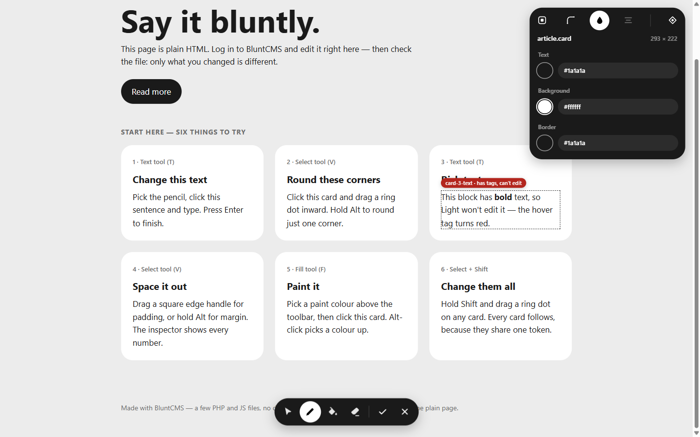
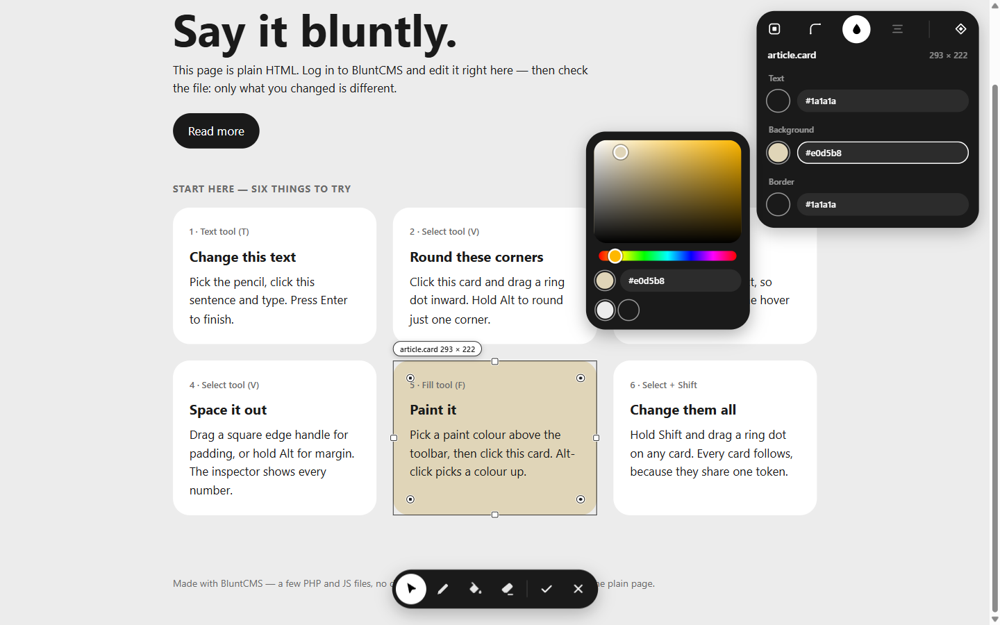
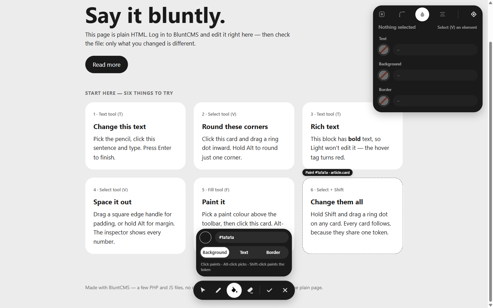

# Tutorial

*BluntCMS 1.0.0-Light · about ten minutes*

This walks you from nothing to editing your own site. Part 1 uses the demo that ships with BluntCMS, so you can try everything safely. Part 2 puts it on your site.

**Using Thick?** Everything here works the same, with a different layout: the toolbar sits on the bottom edge and the inspector is a sidebar on the right. Thick's extra tools (images, formatted text, moving blocks, pages and history) are described in **[the editor guide](editor.md#bluntcms-thick)**.

## Part 1 — Try it on the demo

### 1. Start a local server

You need **PHP 8.1 or newer**. Check with `php -v`.

```bash
git clone https://github.com/Alexander-288/bluntCMS.git
cd bluntCMS
php -S localhost:8000
```

Leave that terminal running.

### 2. Set a password

Open `http://localhost:8000/blunt/setup.php`.

- **Password** — at least 8 characters
- **Token CSS file** — type `demo/css/tokens.css`. This is the file with the demo's shared colours and sizes

Press **Save**. Setup locks itself once a password exists.

### 3. Open the editor

Log in, then open `http://localhost:8000/blunt/edit.php?page=demo/index.html`.

The demo page looks normal, plus three things:

- the **toolbar** at the bottom — Select, Text, Fill, Reset, then Save and Exit
- the **inspector** at the top right — every style of the selected element
- a **hover hint** — move the mouse around: a dashed outline and a tag show what the current tool would act on

### 4. Change some text

Press `T` for the Text tool. Hover the first card: the tag says `Text · card-1-title`. Click the heading, type something, press `Enter`.

Now hover the *Rich text* card's sentence. The tag turns **red**: that block contains a `<strong>` tag, and Light only edits plain text, so it refuses rather than erase your markup.



Click **Read more** with the Text tool too: a small popup lets you change where the link goes.

### 5. Shape something

Press `V` for Select and click a card. You get a bounding box:

- **Ring dots** inside the corners — drag one inward to round all four corners. Hold `Alt` to round just that corner
- **Square handles** on the edges — drag to change padding. Hold `Alt` for margin

A small label next to the cursor shows the value as you drag. The inspector updates live.

### 6. Change every card at once

Hold `Shift` and drag a ring dot. The label now says `--card-radius`, and every card follows — you're editing the **token** in `demo/css/tokens.css`, not the one card.

Try `Shift`-dragging a corner of the big heading: the label says *no token*. The heading's radius doesn't come from a token, so there is nothing shared to change.

### 7. Use the inspector

With a card selected, the inspector's icon bar has four tabs:

- **Box** — margin, border and padding in a diagram
- **Border** — style, width, colour and radius
- **Colour** — text, background and border colours
- **Layout** — alignment; justify, align and gap for flex and grid containers

Number fields work like a design tool: **drag sideways** to scrub, **click** to type, `↑` / `↓` to nudge, and **empty** a field to clear it. A white ring means the value is set on this element; a dotted underline means it comes from a token.

Click a colour dot to open the picker. Drag in the shade area and along the hue bar, or pick one of your token colours below. Click outside to apply, `Esc` to cancel.



### 8. Paint

Press `F` for Fill. A popup appears above the toolbar with the **paint colour** and what to paint — Background, Text or Border.

- **Click** an element to paint it
- **Alt + click** picks up an element's colour
- **Shift + click** paints the shared token instead



### 9. Undo, reset, save

- `Ctrl+Z` / `Ctrl+Shift+Z` undo and redo
- Press `R` for Reset and click something you styled — its inline styles are removed
- `Ctrl+S` or the ✓ button saves. A dot on the button means there are unsaved changes

Now look at what changed:

```bash
git diff demo/
```

Only the characters you edited are different. Everything else in the file — spacing, quotes, comments — is exactly as it was.

### 10. Exit

Press ✕. You land on the plain page: no editor, no CMS code in the source. That's what your visitors get.

When you're done playing, put the demo back with `git checkout demo/`.

## Part 2 — Put it on your site

### 1. Upload the folder

Copy the `blunt/` folder into your site's root, next to your `index.html`:

```
your-site/
  index.html
  about.html
  css/
  blunt/        <- here
```

PHP needs permission to write to your `.html` files, your token CSS file, and the `blunt/` folder.

### 2. Mark what's editable

Give every block of text you want to edit a unique `data-blunt` name:

```html
<h1 data-blunt="hero-title">Hello world</h1>
<p data-blunt="hero-text">We make nice things.</p>
<a data-blunt="cta" href="/contact">Get in touch</a>
```

- Names must be unique on each page
- Keep editable blocks plain text — a block with tags inside, like `<strong>`, can't be edited in Light

Styles need no marking: any element can be selected.

### 3. Add tokens (optional)

Put shared values in one CSS file as variables, and use them with `var()`:

```css
/* css/tokens.css */
:root {
  --accent: #1a1a1a;
  --card-radius: 16px;
  --gap: 24px;
}
```

```css
/* css/site.css */
.card {
  padding: var(--gap);
  border-radius: var(--card-radius);
}
```

`Shift` edits and the inspector's diamond button then change the token for every element at once.

### 4. Set it up

Open `https://your-site.com/blunt/setup.php` **straight after uploading** — until a password is set, anyone could set it. Enter your token file path, like `css/tokens.css`, or leave it empty.

Then edit any page at `https://your-site.com/blunt/edit.php?page=about.html`.

## Under the hood

### Backups

Before every save, the old file is copied into `blunt/backups/` with a timestamp. The last 10 versions of each file are kept.

To roll back, copy a backup over the page:

```bash
cp blunt/backups/about_html.20261003-101500-123456.bak about.html
```

### "This page changed since you opened it"

BluntCMS remembers a fingerprint of the file when you open the editor. If the file changes on disk before you save — an FTP upload, another tab — the save is refused instead of writing to the wrong place. Reload and redo your change.

## Troubleshooting

- **"Could not write the file"** — PHP can't write to the page or folder. Fix the file permissions on your host
- **I forgot my password** — delete `blunt/config.php` and open `setup.php` again
- **Too many wrong passwords** — after 5 tries, login is blocked for 5 minutes
- **A block won't edit** — it has no `data-blunt` name, its name is used twice on the page, or it contains tags. The hover tag tells you which
- **Shift says "no token"** — that property isn't set with `var(--something)` in your CSS, or the variable isn't in your token file
- **nginx** — the `.htaccess` files only work on Apache. Block `blunt/config.php`, `blunt/lib/`, `blunt/data/` and `blunt/backups/` in your nginx config

## Next

- **[Editor reference](editor.md)** — every tool and shortcut
- **[Architecture](architecture.md)** — how saving and security work
